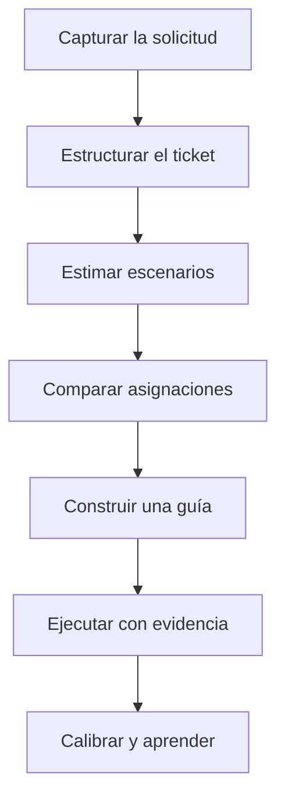

# TicketRoute

<div align="center">

**De una solicitud ambigua a una ruta de trabajo explicable, asignable y verificable.**

Captura · Estructuración · Planeación · Asignación · Ejecución · Aprendizaje


[Demo en línea](https://REEMPLAZAR-CON-TU-DOMINIO.vercel.app) · [Repositorio](https://github.com/REEMPLAZAR-USUARIO/REEMPLAZAR-REPOSITORIO)

</div>

---

## Descripción

TicketRoute es una plataforma de planeación y ejecución de trabajo que transforma solicitudes expresadas en lenguaje natural en rutas operativas trazables.

El sistema conserva la intención original de cada solicitud, ayuda a estructurar su contexto, genera escenarios de estimación, compara alternativas de asignación, construye guías verificables y registra evidencia durante la ejecución. Al finalizar, contrasta lo estimado con el resultado real para mejorar decisiones posteriores.

Su objetivo no es vigilar a las personas ni sustituir el criterio humano. TicketRoute hace visibles las señales utilizadas, explica las consecuencias de cada alternativa y permite que el equipo conserve la decisión final.

## Problema que resuelve

En muchos equipos, las solicitudes llegan por correo, chat, reuniones, notas o mensajes de voz. Al pasar de una idea a la ejecución suelen aparecer cuatro problemas:

- El contexto original se pierde o se fragmenta.
- Las estimaciones se presentan como fechas exactas aunque exista incertidumbre.
- Las asignaciones se realizan sin explicar qué señales fueron consideradas.
- El avance se mide mediante porcentajes, sin evidencia verificable del resultado.

Esto genera retrabajo, expectativas poco realistas, decisiones difíciles de justificar y escaso aprendizaje entre proyectos.

TicketRoute conecta todo el recorrido en un solo sistema y conserva la trazabilidad desde la solicitud inicial hasta el resultado final.

## Propuesta de valor

- **Una sola fuente de verdad:** conserva la captura original y cada transformación posterior.
- **Estimaciones honestas:** utiliza rangos favorable, probable y adverso en lugar de una cifra artificialmente exacta.
- **Asignaciones explicables:** compara capacidad, compromisos, habilidades, ownership y conocimiento declarado.
- **Ejecución verificable:** cada paso define responsable, resultado observable y forma de comprobación.
- **Aprendizaje acumulativo:** compara estimaciones y resultados para mejorar decisiones futuras.
- **Privacidad por diseño:** excluye conexión, presencia, velocidad de escritura y puntuaciones secretas de productividad.
- **Criterio humano:** la automatización propone y explica; el usuario revisa, modifica y confirma.

## Recorrido del producto



## Módulos principales

### Command Center

Vista ejecutiva del workspace. Resume entradas pendientes, tickets listos para planear, capacidad declarada, trabajo en curso y aprendizajes confirmados.

### Capture Hub

Recibe solicitudes mediante texto, dictado, notas o reuniones. Cada captura permanece editable, persistente y aislada por workspace antes de convertirse en un ticket.

### Tickets

Convierte una entrada original en una estructura revisable:

- Objetivo y contexto.
- Alcance y restricciones.
- Criterios de aceptación.
- Subtareas.
- Incógnitas.
- Riesgos.
- Dependencias.

La propuesta puede modificarse antes de ser confirmada.

### Planning Lab

Construye tres escenarios de estimación:

- **Favorable:** condiciones estables y dependencias disponibles.
- **Probable:** ritmo esperado con incertidumbre visible.
- **Adverso:** materialización de riesgos, bloqueos o retrabajo.

Cada rango conserva límites inferiores y superiores. La interfaz explica qué factores reducen, amplían o contextualizan el cálculo.

### Assignment Studio

Compara rutas de asignación considerando:

- Membresía y rol.
- Disponibilidad declarada.
- Horas ya planeadas.
- Habilidades.
- Experiencia en componentes.
- Ownership técnico.
- Objetivos de aprendizaje.

El sistema muestra consecuencias, riesgos y alternativas descartadas. El reparto de esfuerzo sigue siendo editable y debe sumar el 100 % antes de confirmarse.

### Equipo y capacidad

Permite administrar integrantes, invitaciones, roles y perfiles de planeación. Cada persona declara su capacidad semanal y las señales profesionales que desea compartir con el workspace.

### Planning Guide

Convierte una asignación confirmada en una secuencia ejecutable. Cada paso contiene:

- Título y fase.
- Orden.
- Responsable del resultado.
- Porcentaje de esfuerzo.
- Resultado observable.
- Método de comprobación.
- Fuentes, dependencias y riesgos.

### Execution Board

Ejecuta una guía como snapshot estable. Los pasos pueden pasar por estados:

- Pendiente.
- Activo.
- Completado.
- Bloqueado.
- Omitido.

Completar, bloquear u omitir exige evidencia o una razón visible. La guía confirmada no se modifica silenciosamente durante la ejecución.

### Calibración

Compara el rango confirmado con el resultado real. Registra desviaciones, causas y aprendizajes reutilizables para futuras estimaciones.

### Council Mode

Permite solicitar perspectivas complementarias para analizar una decisión. Las recomendaciones conservan contexto y trazabilidad, pero no reemplazan la confirmación humana.

### Notificaciones, integraciones y trabajos en segundo plano

La plataforma conserva preferencias de notificación, eventos de integración, intentos, errores y trabajos en segundo plano para que los procesos operativos permanezcan auditables.

## Datos incluidos para demostración

El entorno de presentación puede poblarse con un workspace ficticio llamado **Northstar Product Studio**, diseñado para mostrar el recorrido completo:

| Entidad | Registros de demostración |
| --- | ---: |
| Integrantes | 2 |
| Invitaciones pendientes | 3 |
| Capturas | 8 |
| Tickets | 8 |
| Estimaciones vigentes | 7 |
| Asignaciones vigentes | 5 |
| Guías vigentes | 5 |
| Pasos de ejecución | 25 |
| Ejecuciones | 4 |
| Calibraciones | 2 |
| Sesiones de Council Mode | 3 |
| Notificaciones | 16 |
| Eventos de integración | 30 |
| Trabajos en segundo plano | 35 |

Estos registros son ficticios y se utilizan únicamente para demostrar el funcionamiento del producto.

## Principios de diseño

### Explicabilidad antes que automatización

Una recomendación debe mostrar las señales y límites que la originaron.

### Rangos antes que falsa precisión

La incertidumbre no se oculta detrás de una fecha exacta.

### Evidencia antes que porcentajes

El avance se vincula con resultados observables y comprobaciones explícitas.

### Privacidad antes que vigilancia

La plataforma usa información declarada y excluye métricas individuales ocultas.

### Decisión humana antes que imposición algorítmica

Las propuestas pueden revisarse, editarse, descartarse y confirmarse por una persona autorizada.

## Arquitectura

TicketRoute utiliza un monolito modular con separación entre presentación, aplicación, dominio e infraestructura.

```text
src/
├── app/                    # Rutas y páginas de Next.js
├── application/            # Casos de uso y orquestación
├── components/             # Componentes compartidos
├── domain/                 # Entidades, esquemas y reglas de negocio
├── features/               # Módulos funcionales
├── infrastructure/
│   └── supabase/           # Clientes SSR, navegador y acceso a datos
├── lib/                    # Utilidades transversales
├── styles/                 # Tokens y estilos globales
└── test/                   # Configuración de pruebas

supabase/
├── migrations/             # Esquema, funciones, políticas y datos base
└── tests/                  # Verificación SQL y aislamiento RLS
```

### Capas

| Capa | Responsabilidad |
| --- | --- |
| Presentación | Rutas, layouts, formularios y componentes |
| Aplicación | Casos de uso y coordinación de operaciones |
| Dominio | Reglas, contratos, validaciones y cálculos |
| Infraestructura | Supabase, PostgreSQL, Auth, SSR e integraciones |

## Stack tecnológico

- **Next.js 16** con App Router y Server Components.
- **React 19**.
- **TypeScript**.
- **Supabase Auth** para registro, OTP, sesiones y recuperación de contraseña.
- **PostgreSQL** como fuente de verdad.
- **Row Level Security** para aislamiento multiworkspace.
- **Supabase SSR** para sesiones seguras mediante cookies.
- **Zod** para validación de datos.
- **React Hook Form** para formularios complejos.
- **Lucide React** para iconografía.
- **CSS Modules** y tokens visuales.
- **Vitest** para pruebas automatizadas.
- **Vercel** para despliegue.

## Seguridad

TicketRoute aplica una estrategia de seguridad por capas:

- Autenticación administrada por Supabase.
- Sesiones SSR conservadas mediante cookies.
- RLS habilitado en las tablas expuestas.
- Aislamiento de información por `workspace_id`.
- Comprobación de membresía y rol dentro de PostgreSQL.
- Funciones autorizadas para operaciones sensibles.
- Tokens de invitación de un solo uso almacenados mediante hash.
- Registro de eventos relevantes.
- Claves secretas fuera del cliente.

> La aplicación cliente únicamente debe recibir la URL pública de Supabase y la Publishable key. Nunca se debe exponer la `service_role`.

## Requisitos

- Node.js 22 o superior.
- npm 10 o superior.
- Una cuenta de Supabase.
- Un proyecto de Supabase con PostgreSQL y Auth.
- Git.
- Cuenta de Vercel para el despliegue.

## Instalación local

### 1. Clonar el repositorio

```bash
git clone https://github.com/REEMPLAZAR-USUARIO/REEMPLAZAR-REPOSITORIO.git
cd REEMPLAZAR-REPOSITORIO
```

### 2. Instalar dependencias

```bash
npm install
```

### 3. Configurar variables de entorno

Copia el archivo de ejemplo:

```bash
cp .env.example .env.local
```

En Windows PowerShell:

```powershell
Copy-Item .env.example .env.local
```

Completa:

```env
NEXT_PUBLIC_SUPABASE_URL=https://TU-PROYECTO.supabase.co
NEXT_PUBLIC_SUPABASE_PUBLISHABLE_KEY=sb_publishable_TU_CLAVE_PUBLICA
NEXT_PUBLIC_SITE_URL=http://localhost:3000
```

No agregues claves SMTP, contraseñas de base de datos ni `service_role` a variables con prefijo `NEXT_PUBLIC_`.

### 4. Aplicar las migraciones

Las migraciones se encuentran en:

```text
supabase/migrations/
```

Deben ejecutarse en orden cronológico. Puedes aplicarlas mediante Supabase CLI o copiar su contenido al SQL Editor de Supabase respetando el orden de los archivos.

Antes de cargar datos de demostración, verifica que se hayan aplicado todas las migraciones requeridas por la versión actual del proyecto.

### 5. Iniciar el servidor

```bash
npm run dev
```

Abre:

```text
http://localhost:3000
```

## Scripts disponibles

| Comando | Descripción |
| --- | --- |
| `npm run dev` | Inicia el entorno local |
| `npm run build` | Genera el build de producción |
| `npm run start` | Ejecuta el build de producción |
| `npm run lint` | Revisa reglas de ESLint |
| `npm run test` | Ejecuta las pruebas con Vitest |
| `npm run test:watch` | Ejecuta Vitest en modo observación |
| `npx tsc --noEmit` | Comprueba los tipos sin generar archivos |

## Validación antes de publicar

Ejecuta:

```bash
npm run test
npm run lint
npx tsc --noEmit
npm run build
```

El proyecto está listo para desplegar cuando los cuatro comandos finalizan sin errores.

## Pruebas funcionales recomendadas

### Autenticación

- Registrar una cuenta.
- Confirmar el correo con OTP.
- Iniciar y cerrar sesión.
- Recuperar y cambiar la contraseña.
- Verificar rutas privadas.

### Workspace

- Completar el onboarding.
- Crear un workspace.
- Invitar a un integrante.
- Aceptar la invitación.
- Cambiar roles con una cuenta autorizada.
- Comprobar el aislamiento RLS con una segunda cuenta.

### Recorrido principal

- Crear capturas manuales y por dictado.
- Convertir una captura en ticket.
- Editar y confirmar el ticket.
- Revisar y confirmar los tres rangos.
- Comparar escenarios de asignación.
- Confirmar el responsable y la distribución de esfuerzo.
- Construir y confirmar una guía.
- Iniciar una ejecución.
- Completar pasos con evidencia.
- Bloquear, reanudar u omitir un paso con justificación.
- Finalizar una ejecución.
- Registrar una calibración.

## Configuración de Supabase Auth

En **Authentication → URL Configuration** configura:

```text
Site URL:
http://localhost:3000
```

Durante el desarrollo agrega:

```text
http://localhost:3000/**
```

En producción reemplaza el `Site URL` por el dominio definitivo y agrega el dominio a las Redirect URLs.

El proyecto utiliza un código OTP de seis dígitos para confirmar el correo.

## Despliegue en Vercel

1. Sube el proyecto a un repositorio de GitHub.
2. Importa el repositorio desde Vercel.
3. Selecciona Next.js como framework.
4. Configura Node.js 22.
5. Agrega las variables de entorno.
6. Ejecuta el primer deployment.
7. Copia el dominio generado.
8. Actualiza `NEXT_PUBLIC_SITE_URL`.
9. Configura el dominio en Supabase Auth.
10. Realiza un nuevo deployment.

Variables mínimas:

```env
NEXT_PUBLIC_SUPABASE_URL=
NEXT_PUBLIC_SUPABASE_PUBLISHABLE_KEY=
NEXT_PUBLIC_SITE_URL=
```

## Estado del proyecto

TicketRoute cuenta con un recorrido funcional de extremo a extremo:

- Autenticación y rutas privadas.
- Workspaces, membresías, roles e invitaciones.
- Captura persistente.
- Organización de tickets.
- Estimación por rangos.
- Comparación de asignaciones.
- Capacidad declarada.
- Construcción de guías.
- Execution Board con evidencia y bloqueos.
- Calibración de resultados.
- Council Mode.
- Notificaciones e integraciones.
- Diagnóstico del sistema.

## Roadmap

- Automatizar la ejecución segura de trabajos en segundo plano.
- Incorporar conectores con herramientas externas de trabajo.
- Ampliar el historial de comparables para estimaciones.
- Añadir exportación de decisiones y evidencia.
- Incorporar analítica agregada por workspace.
- Fortalecer pruebas E2E del recorrido completo.
- Añadir más proveedores de modelos para Council Mode.

## Autor

Desarrollado por **Adrián Ramírez**.

Proyecto creado para demostrar que la planeación de trabajo puede ser explicable, verificable y respetuosa de las personas.

